<!-- AOC TILES BEGIN -->
<h1 align="center">
  Advent of Code - 121/500 ⭐
</h1>
<h1 align="center">
  2024 - 50 ⭐ - Python
</h1>

<a href="2024/day11.py">
  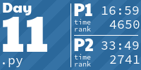
</a>

<a href="2024/day13.py">
  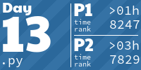
</a>

<a href="2024/day15.py">
  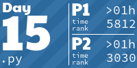
</a>

<a href="2024/day19.py">
  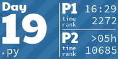
</a>

<a href="2024/day21.py">
  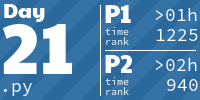
</a>
<a href="2024/day22.py">
  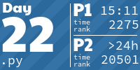
</a>
<a href="2024/day23.py">
  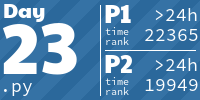
</a>
<a href="2024/day24.py">
  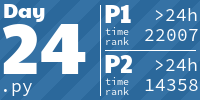
</a>
<a href="2024/day25.py">
  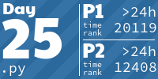
</a>
<h1 align="center">
  2023 - 21 ⭐ - Rust
</h1>

<h1 align="center">
  2022 - 50 ⭐ - Python
</h1>

<a href="2022/day11/__init__.py">
  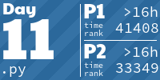
</a>

<a href="2022/day13/__init__.py">
  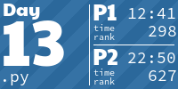
</a>
<a href="2022/day14/__init__.py">
  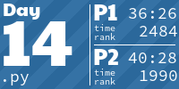
</a>
<a href="2022/day15/__init__.py">
  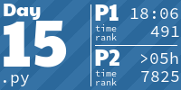
</a>
<a href="2022/day16/__init__.py">
  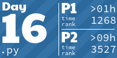
</a>
<a href="2022/day17/__init__.py">
  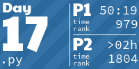
</a>

<a href="2022/day19/__init__.py">
  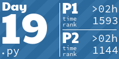
</a>
<a href="2022/day20/__init__.py">
  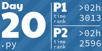
</a>
<a href="2022/day21/__init__.py">
  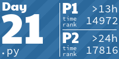
</a>
<a href="2022/day22/__init__.py">
  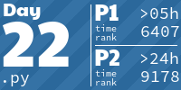
</a>

<a href="2022/day24/__init__.py">
  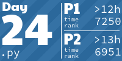
</a>
<a href="2022/day25/__init__.py">
  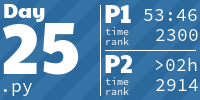
</a>
<!-- AOC TILES END -->